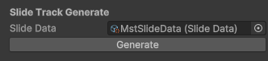

# unity-photo-movie-maker
Timelineを使用したスライドショー作成サンプルです。

## Unityバージョン
- 6000.0.25f1

## 使用アセット・パッケージ
※リポジトリ内には含めていないため、別途インポートする必要があります。
- DOTWeen https://assetstore.unity.com/packages/tools/animation/dotween-hotween-v2-27676
- Unity-Excel-Importer-Maker https://github.com/tsubaki/Unity-Excel-Importer-Maker

## フォルダ構成
<a href="Assets/MovieMaker">Assets/MovieMaker</a>配下に今回作成した資産を格納しています。 
以下はそのフォルダ構成になります。

| フォルダ名          | 概要                 |
|----------------|--------------------|
| Prefabs | スライドとして生成するUIプレハブを格納しています。 |
| Resources | スライドに表示するテクスチャを格納しています。 |
| Scenes | メインとなるSceneを格納しています。 |
| Scripts | 今回Scriptを格納しています。 |
| Timeline | スライドを表示するTimelineと生成用のデータを格納しています。 |

## 使用方法

- 事前準備
  - `使用アセット・パッケージ`に記載のリンクから必要なアセットをインポートします。
- スライド用テクスチャの用意
  - <a href="Assets/MovieMaker/Resources">Assets/MovieMaker/Resources</a>配下にスライドで使用するテクスチャをインポートします。
- スライド用データの作成
  - <a href="Assets/MovieMaker/Timeline/SlideData">MstSlideData.xlsx</a>内の各パラメータを編集します。
    | パラメータ名 | 概要 |
    | -- | -- |
    | Frame | キーフレームを生成するフレーム(sec)を指定します。 |
    | TexturePath | 表示するテクスチャパスを指定します。 |
    | Message | （テクスチャを使用しない場合）表示するテキストを指定します。 |
    | PositionX、PositionY | 表示する位置(スクリーン座標)を指定します。 |
    | MoveSpeedX、MoveSpeedY | 移動速度を指定します。 |
    | Scale | テクスチャ、テキストの大きさを指定します。 |
    | ShowDuration | 表示時間(sec)を指定します。 |
    | FadeInDuration | フェードイン時間(sec)を指定します。 |
    | FadeOutDuration | フェードアウト時間(sec)を指定します。 |
  - Unity-Excel-Importer-Makerを使用して、ExcelからScriptableObjectを生成します。
    - アセット導入後、Excelファイルを`右クリック > XLS Import Settings...`から生成できます。
    - 詳細な使用方法については公式ドキュメントをご参照ください。
- Timelineの作成
  - <a href="Assets/MovieMaker/Timeline">SlideTimeline.playable</a>を選択後、Inspector内`Slide Track Generate > Slide Data`にスライド用データを設定します。 
    `Generate`ボタンを押下すると、Timeline内にキーフレームが設定されたトラックが生成されます。 
    
  - `SlidePlayableTrack`という名前のトラック以外は再生成されないため、必要に応じてスライド以外のトラックを追加しても問題ありません。
